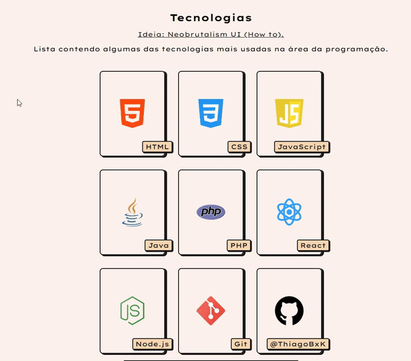

# Neobrutalism UI (Card)

Criei esse projeto com o intuito principal de entender/aprender melhor um pouco de estilos visuais no design gráfico. Aplicando essas técnicas, posso ter uma percepção melhor antes de criar um projeto, escolhendo qual UI seguir, se desejo algo mais minimalista ou extravagante, vintage ou orgânico, entre outros estilos visuais. 




- Cards contendo imagem e descrição sobre algumas linguagens de programação
- Estilo: Neobrutalismo com cores vibrantes e saturadas, sombras e bordas arredondadas 


Ideia principal: [Neobrutalismo UI (Como fazer)](https://dribbble.com/shots/20764973-Neobrutalism-UI-How-to)
## Rodando localmente

Clone o projeto

```bash
  git clone https://github.com/ThiagoBxK/neobrutalism-ui
```

Entre no diretório do projeto

```bash
  cd neobrutalism-ui
```

Abra o arquivo index.html no seu navegador ou instale a extensão [Live Server](https://marketplace.visualstudio.com/items?itemName=ritwickdey.LiveServer) do VSCode.

## Stack utilizada

HTML, CSS, JavaScript

##
Projeto desenvolvido para fins educacionais, incentivando a aprendizagem.
Caso use meu codigo por favor dar os devidos direitos a [@ThiagoBxK](https://github.com/ThiagoBxK)
